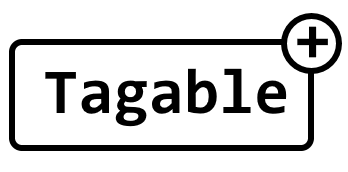

  

## About

The idea is to provide a simple platform that can be used to tag abstracted resources.  

## Development

> The implementation is subject to major changes until a v1 release, from which point versioning will be [semver](https://semver.org)

This project is built with Typescript.  
To get started, run `npm install` to install dependencies.  
Make sure that your environment is not set to `production` or you will not install the dev dependencies.
Feel free to open Issues/PRs with suggestions/problems/improvements.

### Maintainers

- Jonathan Marsh - [j-m](https://github.com/j-m)

## See also

[oaty](https://github.com/jmsv/oaty)

### Changelog

#### `0.1.0`

- Initial proof of concept
